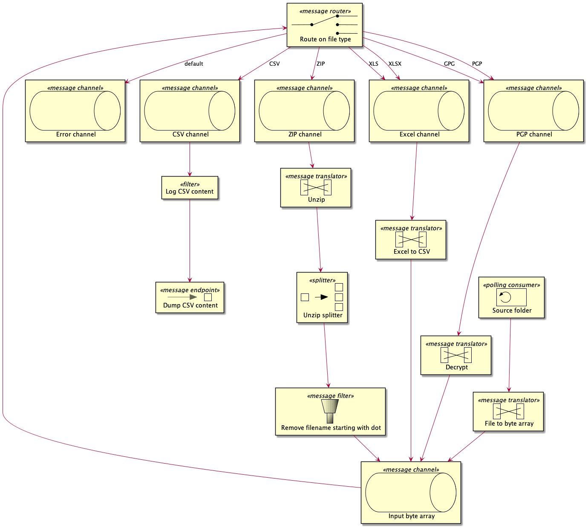

# Experiment: Apache Camel

This project aims to experiment with [Apache Camel](https://camel.apache.org/), especially with its [Java DSL](https://camel.apache.org/manual/latest/java-dsl.html).

To do so, we will build a simple file flow that takes files into a source folder and extract, from those input files, CSV content that we dump in a target folder.

## Idea



There is 1 entry :

- the source folder poller

There are 2 exits :

- the dump to target folder
- the error channel

## Disclaimer

I know that the *LogHandler* should not use `System.out.println` or `error.printStackTrace` ...
This is just a very raw handler to dump information in console =)

## Test me

```sh
mvn spring-boot:run
```

Once started, move a file from `data/source-example` to `data/source`.
You should see some log about what is going on in the system.
Also, you should notice some new files into `data/target`.
